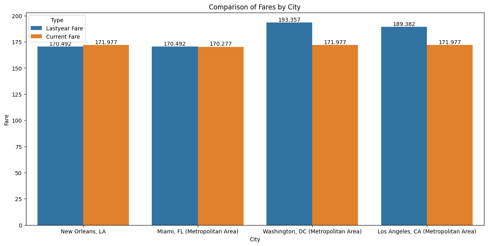
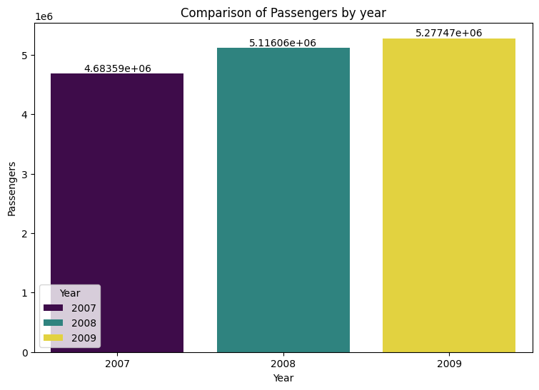

---

## 🔍 Dataset Description

| Column Name      | Description |
|------------------|-------------|
| `city`           | City name (with region) |
| `cur_fare`       | Current year average airfare |
| `ly_fare`        | Last year average airfare |
| `cur_passengers` | Current year passenger count |
| `ly_passengers`  | Last year passenger count |
| `distance`       | Trip distance in nautical miles |
| `year`, `quarter`| Date fields |
| `citymarketid`   | Unique ID per city |
| `trip_id`        | Trip reference ID |

---

## 📊 Key Steps

### 1. 📦 Data Cleaning & Preparation
- Removed null values and duplicate columns
- Converted `distance` from float to integer
- Renamed ambiguous columns for clarity
- Standardized city names

### 2. 📈 Exploratory Data Analysis
- Compared mean airfare vs. passenger count across four major cities
- Analyzed yearly changes for New Orleans from 2007–2009
- Used bar charts for comparative visual insights

### 3. 📉 Correlation Analysis
- Calculated Pearson correlation between airfare and passengers
- Found a **weak positive correlation** (0.17) suggesting limited dependency

---

## 📌 Business Insights

- Cities with high average fares (e.g. DC, LA) still maintained steady passenger counts
- Passenger volume increased over years despite slight fare hikes
- Pricing alone may not drive travel behavior — other factors (service, necessity, route demand) likely play a role

---

## 📊 Visual Highlights

### 📊 Average Fare by City (Current vs Last Year)

### 👥 Passenger Count by Year (New Orleans)

### 💰 Fare Trend by Year (New Orleans)

---

## 📈 Result Summary

| Metric                      | Value         |
|----------------------------|---------------|
| Dataset Size               | ~6,699 rows    |
| Cities Analyzed            | 90+            |
| Correlation (Fare vs Pax)  | 0.1735 (weak +ve) |
| Trend                      | Passengers ↑ even as Fares ↑ slightly |
| Tool Used for Analysis     | Python, Jupyter, Seaborn |

---

## 🔮 Future Enhancements

- **Predictive Modeling**: Use regression or time-series to forecast fare elasticity
- **Market Segmentation**: Split analysis by business vs leisure travelers
- **External Factors**: Add fuel cost, holidays, competitor pricing
- **Interactive Dashboard**: Migrate insights to Power BI or Tableau

---

## 🙋🏻 Contribution & Acknowledgment

- Dataset: [Kaggle - Consumer Airfare](https://www.kaggle.com/datasets)
- Reference: *“A Python Data Analyst's Toolkit” by Gayathri Rajagopalan*
- Author: [Praveen S](mailto:praveen.s.analyst@gmail.com)

---

## 📎 Project Outcome

This project simulates the kind of ad-hoc and business-driven exploratory work often performed by data analysts in **retail, transport, or banking** sectors. It reflects proficiency in:

✅ EDA  
✅ Business interpretation  
✅ Visualization and storytelling  
✅ Report-ready documentation  
✅ Python workflow for real-world datasets

---

